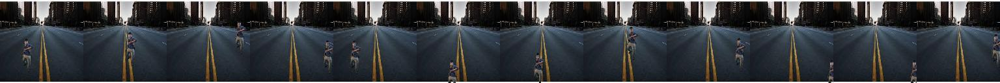
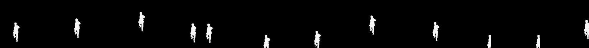
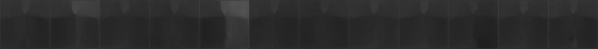

## [High Quality Monocular Depth Estimation via Transfer Learning (arXiv 2018)](https://arxiv.org/abs/1812.11941)
This is a modification of the Depth Estimation [repository](https://github.com/ialhashim/DenseDepth) by **Ibraheem Alhashim** and **Peter Wonka**.

## Procedure for Creating Dataset

- Background images were chosen from random empty images from google. To keep the size of downloaded images same, the keyword `imagesize:225x225`.
- Foreground images of proportionate size were also downloaded from google.
- Using GIMP tool masks were created for these 100 images.
- The foreground images and masks were separated into two different folders and had the same filename but with different extension(`.png` and `.jpg` respectively)
- A flip operation using PIL was run on files of both the folders simultaneously.
- Due to an error 1 image was discarded leaving 99 images for foreground. However, there were 106 background images to compensate for the loss.
- Three folders `fg`, `bg`, `mask` were created containing respective images.
- A python implementation was written in a Jupyter notebook which looped over all the background images. In this loop all the foreground images along with their flips were loaded for each background image. Within the inner loop, another loop generated 20X2 random numbers which would serve as coordinates for pasting the foreground over the background. Care was taken that the foreground image did not go outside the background image. A reference black image of the same size as background image served as the background for masks. The foreground and masks were simultaneously pasted in the random coordinates generated. As a result 419,760 background and mask images were generated.
- All this processing was done in the local environment to save I/O time in gdrive.
- The files were then zipped and uploaded in google drive.
- The reference code was downloaded and modifications were done to give the depth images.

## Reference Images

### Overlay Images

### Mask Images

### Depth Images

## Work In Progress

It was noticed that the colab file used NYU dataset which contains images of indoor spaces. As the images are generated programatically, we would like to divide the background images into two categories and train the indoor images on NYU pretrained model and the outdoor images on KITTY dataset.
